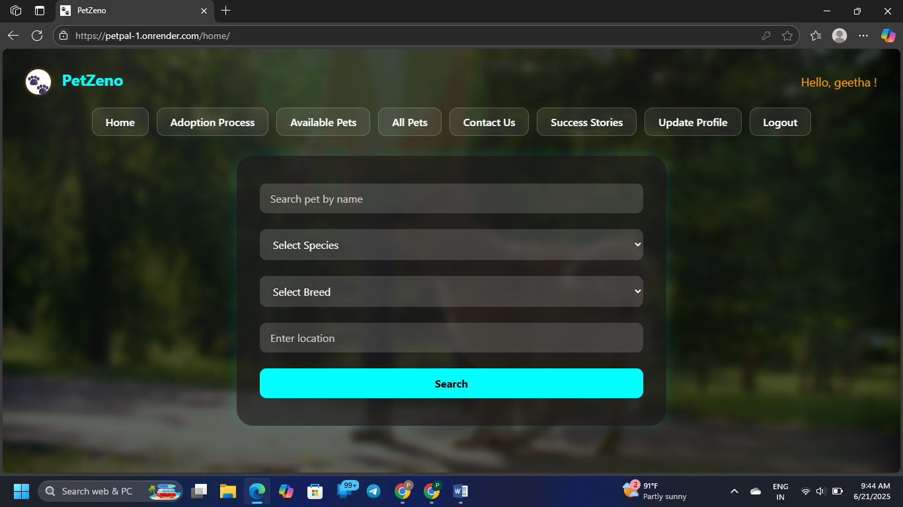
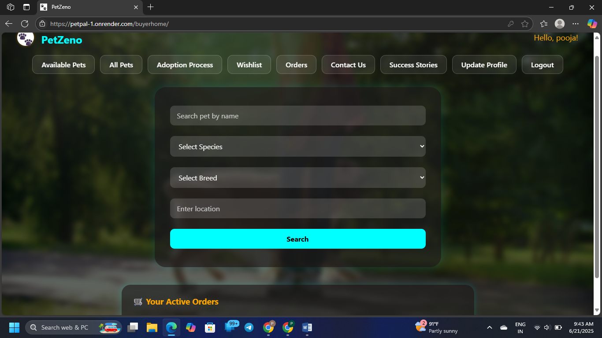
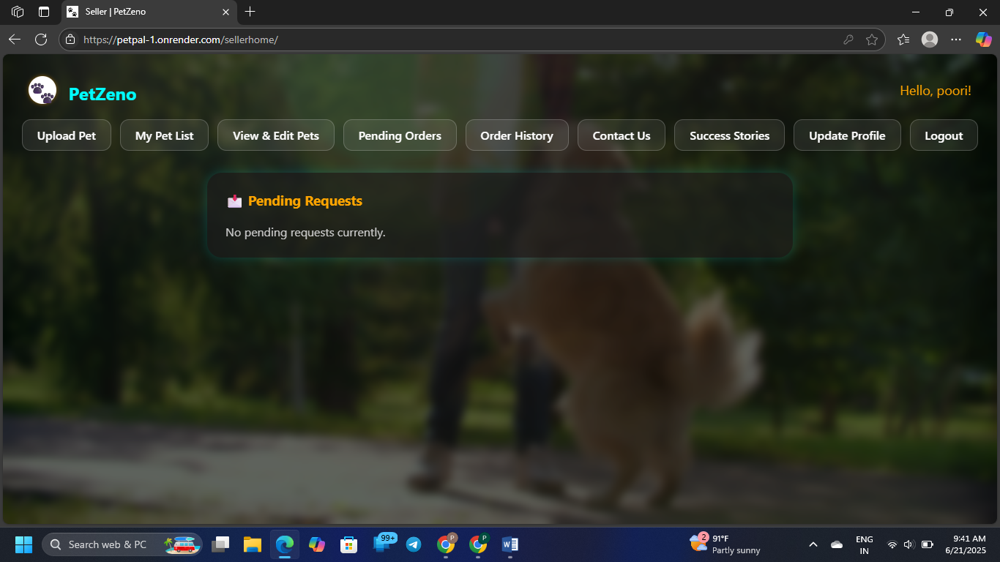
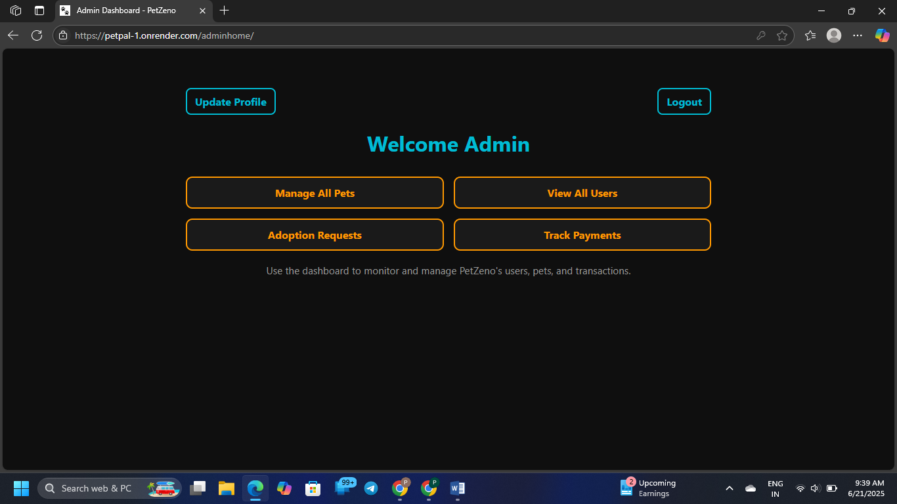

# 🐾 PetPal

**PetPal** is a Django-based web application designed to facilitate pet adoption. It provides an intuitive platform for users to view pets, register, log in, and apply for adoption. The system also supports admin in managing pet profiles and handling user requests.

---

## 📸 Screenshots

### 🏠 Home Page - Guest
[](assets/screenshots/screen1.png)

### 🏠 Home Page - Buyer
[](assets/screenshots/screen2.png)

### 🏠 Home Page - Seller
[](assets/screenshots/screen3.png)

### 🏠 Home Page - admin
[](assets/screenshots/screen4.png)

### 🛠 Django Admin Panel
[](assets/screenshots/screen5.png)

---

## 🚀 Features

- User registration and authentication using sessions
- View pets available for adoption 
- Submit adoption applications
- Admin dashboard for managing pet listings and applications
- Contact form and informational pages
- Responsive UI with dynamic content rendering

---

## 🛠 Tech Stack

- **Backend**: Django, Python 3
- **Frontend**: HTML5, CSS3, Javascript
- **Database**: MySQL(for development), PostgreSQL (for production)
- **Deployment**: Render, Noen
- **Version Control**: Git

---

## 📦 Project Structure

```
petpal/
├── manage.py
├── petpal/              # Django project settings
├── users/               # User management app
├── pets/                # Pet listings and adoption logic
├── templates/           # HTML templates
├── static/              # Static files (CSS, JS)
├── media/               # Uploaded media (e.g. pet photos)
├── requirements.txt
├── render.yaml
└── .env.example
```

---

## 🔧 Setup Instructions

1. **Clone the repository**:
   ```bash
   git clone https://github.com/yourusername/petpal.git
   cd petpal
   ```

2. **Create a virtual environment**:
   ```bash
   python -m venv venv
   source venv/bin/activate  # or venv\Scripts\activate on Windows
   ```

3. **Install dependencies**:
   ```bash
   pip install -r requirements.txt
   ```

4. **Set up environment variables**:
   - Create a `.env` file from `.env.example`
   - Fill in secrets such as `SECRET_KEY`, `DEBUG`, and `DATABASE_URL`

5. **Run migrations**:
   ```bash
   python manage.py migrate
   ```

6. **Create superuser**:
   ```bash
   python manage.py createsuperuser
   ```

7. **Start the development server**:
   ```bash
   python manage.py runserver
   ```

---

## 📝 License

This project is licensed under the MIT License - see the [LICENSE](LICENSE) file for details.

---

## 📬 Contact

For inquiries or support, please reach out to the project maintainer.
